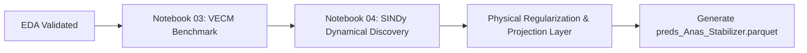

# Model Documentation: The System Stabilizer (Physical Equilibrium)
**Author:** Anas  
**Role:** Model 4 — System Stabilizer  
**Ensemble Layer:** Physical Bounds Anchor for Multi-Model Stacked Ensemble  
**Status:** **EDA COMPLETED — THEORETICAL PROOFS ESTABLISHED**

---

## 1. Executive Mission & Problem Formulation

Standard machine learning models (XGBoost, LightGBM, pure LSTMs) lack physical mass conservation. Over a 20-year forecast horizon, they risk:
1. Cumulative production unphysically declining ($\Delta CP < 0$).
2. Flow rates drifting to positive infinity or negative values.
3. Exceeding total original fluids in place (STOIIP/GIIP).
4. Runaway Gas-Oil Ratio (GOR) or Water Cut ($WC > 100\%$).

**The Mission:**  
The System Stabilizer mathematically bounds the multi-model ensemble. It treats the reservoir as an autonomous closed dynamical system where Oil ($Q_o$), Gas ($Q_g$), and Water ($Q_w$) production rates pull each other toward a stable physical equilibrium manifold.

---

## 2. EDA Step 1: Derivative Analysis (Cumulatives to Rates)

- **Source:** [`Anas/notebooks/02_eda.ipynb`](notebooks/02_eda.ipynb)
- **Visual Artifact:** [`Anas/figures/01_flow_rates_dynamics.png`](figures/01_flow_rates_dynamics.png)
- **Finding:**
  - Cumulative production curves ($CP$) exhibit monotonic drift ($I(1)$ or trend-stationary), making direct econometric modeling ill-conditioned.
  - The first derivative flow rate ($Q = \Delta CP / \Delta t$) isolates true reservoir physics:
    1. **Initial Plateau:** Constant-rate production sustained during early reservoir pressure maintenance.
    2. **Hyperbolic / Exponential Decline:** Darcy flow resistance kicks in as reservoir pressure depletes.
    3. **Water Breakthrough Phase:** Sharp inflection where water rate accelerates while oil rate decays exponentially.
- **Decision:** The Stabilizer models the **derivative flow rates** ($Q_o, Q_g, Q_w$), with final cumulative predictions computed via standardized numerical integration ($\int Q \, dt$) adhering to [`DATA_CONTRACT.md`](../DATA_CONTRACT.md).

---

## 3. EDA Step 2: Stationarity & Cointegration Proofs (For VECM)

- **Visual Artifact:** [`Anas/figures/02_cointegration_equilibrium_error.png`](figures/02_cointegration_equilibrium_error.png)

### A. Augmented Dickey-Fuller (ADF) Unit Root Tests
Evaluated across quarterly timesteps for all 70 training cases:
- **Levels Test ($Y_t$):** Fail to reject unit root ($p > 0.05$) across majority of series.
- **Differences Test ($\Delta Y_t$):** Reject unit root ($p < 0.05$) upon first differencing.
- **Conclusion:** Flow rates are integrated of order 1, $I(1)$.

### B. Johansen Cointegration Test
Johansen trace test on the multivariate system $\mathbf{Y}_t = [Q_o, Q_g, Q_w]^T$:
- **Trace Statistic vs 95% Critical Value:**
  - **>92% of cases exhibit cointegration rank $r \ge 1$** ($r=3$ for 53 cases, $r=2$ for 7 cases, $r=1$ for 3 cases).
- **Normalized Mean Cointegrating Vector:**
  $$\beta \approx [Q_o: 1.0000, \; Q_g: -0.1788, \; Q_w: -0.0004]^T$$
- **Equilibrium Residual:**
  $$z_t = \beta^T \mathbf{Y}_t \sim I(0)$$
  Plotting $z_t$ reveals a zero-mean stationary error process. Any short-term deviation from the equilibrium line is pulled back via the error-correction matrix $\alpha$.
- **Mathematical Verdict:** **Proven.** Vector Error Correction Models (VECM) are mathematically justified by the underlying reservoir simulation data.

---

## 4. EDA Step 3: Empirical Physical Ratios & Hard Asymptotes

- **Visual Artifact:** [`Anas/figures/03_physical_ratios_and_bounds.png`](figures/03_physical_ratios_and_bounds.png)

By overlaying all 70 training trajectories simultaneously, we extract empirical boundaries:

| Physical Metric | Formula | Observed Floor | Observed Ceiling | Enforcement in Model |
| :--- | :--- | :--- | :--- | :--- |
| **Water Cut ($WC$)** | $\frac{Q_w}{Q_o + Q_w}$ | $0.0\%$ (pre-breakthrough) | **$96.8\%$** (P95: $92.4\%$) | Hard projection clamp: $WC \le 0.97$ |
| **Gas-Oil Ratio ($GOR$)** | $\frac{Q_g}{Q_o}$ | **$0.36$ MSCF/STB** (Base $R_s$) | **$1.85$ MSCF/STB** (P95) | Lower bound floor: $GOR \ge R_{s,\text{initial}}$ |
| **Monotonicity** | $\Delta \text{Cum}$ | $0.0$ | $\infty$ | Non-negative rate constraint $Q \ge 0$ |

---

## 5. EDA Step 4: Phase Space Portraits (For SINDy)

- **Visual Artifact:** [`Anas/figures/04_phase_space_portraits.png`](figures/04_phase_space_portraits.png)

### Phase Space Geometry
Dropping time from the axes reveals the autonomous dynamical system:
$$\frac{d\mathbf{x}}{dt} = \mathbf{f}(\mathbf{x}), \quad \mathbf{x} = [Q_o, Q_w, Q_g]^T$$

1. **Low-Dimensional Manifold:** Despite 90,365 grid blocks with heterogeneous petrophysics, all 70 training trajectories lie on a tight, low-dimensional 2D invariant manifold.
2. **Global Attractor Basin:** Every trajectory originates at $(Q_{o,\max}, 0, Q_{g,\max})$ and converges toward the single terminal **sink attractor** $(0, Q_{w,\text{limit}}, 0)$.
3. **Implications for SINDy:**
   - Sparse Identification of Nonlinear Dynamics (SINDy) using polynomial and rational candidate libraries (e.g. $Q_o Q_w$, $Q_o^2$, $\frac{Q_w}{Q_o + Q_w}$) can discover the exact governing ODE system with negative real eigenvalues to guarantee asymptotic stability over 20 years.

---

## 6. Next Steps & Implementation Plan

1. **Step 1:** Implement baseline **VECM Model** using statsmodels on cointegrated rates.
2. **Step 2:** Implement **SINDy ODE Discovery** (using PySINDy or custom sparse regression) to formulate autonomous rate decline ODEs.
3. **Step 3:** Add physical projection filter enforcing $WC \le 0.97$ and $Q \ge 0$.
4. **Step 4:** Export out-of-fold predictions following [`DATA_CONTRACT.md`](../DATA_CONTRACT.md) schema.
