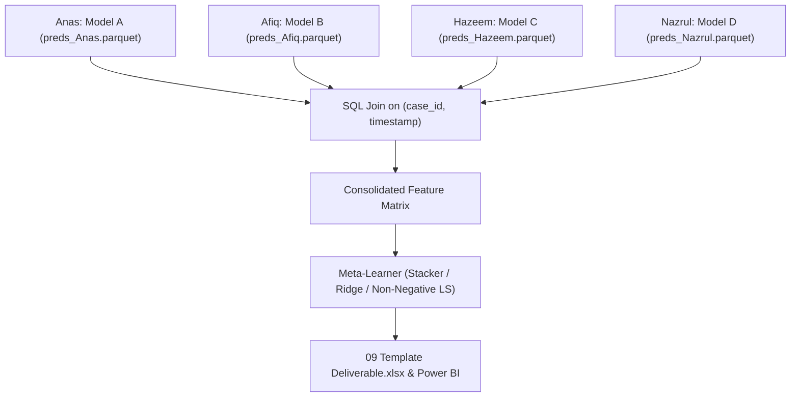

# The Immutable Data Contract
**Project:** ExxonMobil DataWorks Challenge 2026 — Surrogate Modeling & History Matching  
**Team Members:** Anas, Afiq, Hazeem, Nazrul  
**Architecture:** Multi-Model Stacked Ensemble  
**Status:** **ACTIVE / IMMUTABLE**

---

## 🎯 Purpose & Philosophy

If four team members build state-of-the-art individual models with slightly different preprocessing assumptions, inconsistent feature definitions, or incompatible time splits, the final stacked ensemble will fail completely.

> [!IMPORTANT]
> **Before anyone calls `model.fit()`, all team members must strictly conform to this contract.**  
> No private feature engineering scripts or undocumented transformations are permitted. All base models will train on the exact same data source and output identical prediction schemas.

---

## 1. The "Golden" Input Rule

No team member cleans, scales, or transforms raw data independently.

1. **Single Source of Truth:**  
   The centralized preprocessing pipeline generates a single, versioned, read-only file:
   ```text
   data/processed/golden_features.parquet
   ```
2. **Raw Data Ingestion:**
   - **Uncertainty Parameters (`01 Introduction.xlsx`):**  
     `Fault Transmissibility`, `Porosity Multiplier`, `Permeability Multiplier`, `Aquifer Pore Volume` for all 100 cases.
   - **Historical Field Observations (`02 Field Production.xlsx`):**  
     `RAMP_History` rates & cumulatives (1998-01-01 to 2008-01-01), water injection rates, and historical simulation curves.
   - **Aggregated 3D Petrophysics (`03` to `08` Case Workbooks):**  
     Because raw 3D grids contain 90,365 cells per case (~3.3 GB total), the golden pipeline computes standardized summary statistics per case and per reservoir zone (total pore volume, mean/std porosity, directional permeability harmonics, net-to-gross averages).
3. **Immutability:**  
   Once generated, `golden_features.parquet` is locked. If new features or lags are needed, they must be proposed and integrated into the central pipeline so all teammates benefit simultaneously.

---

## 2. Hard Splits & Out-Of-Fold (OOF) Scheme

To train a leak-free **Stacked Meta-Learner**, we enforce both case-level grouping and temporal bounds.

### A. Case-Level Splits (Competition-Aligned)
The dataset comprises 100 reservoir simulation cases:
- **Train Pool (Cases 1 – 70):** Used for base model training and meta-learner calibration.
- **Validation Pool (Cases 71 – 85):** Dedicated for hyperparameter tuning and model validation.
- **Test / Blind Pool (Cases 86 – 100):** Unseen holdout cases for generalizability testing.

### B. Out-Of-Fold (OOF) Cross-Validation Scheme for Stacking
To give the Meta-Learner a full, uncorrupted dataset for learning ensemble weights:
- **5-Fold `GroupKFold`** partitioned strictly by `case_id` on Cases 1 – 70.
- Each member's model trains on 4 folds (56 cases) and generates out-of-sample predictions on the remaining 1 fold (14 cases).
- Repeating this across all 5 folds creates a complete, leak-free **OOF prediction matrix** covering all 70 training cases.
- The Meta-Learner trains on this OOF matrix. **Never train the meta-learner on in-sample base model predictions.**

### C. Temporal Boundaries
- **History Matching Calibration Period:** `1998-01-01` to `2008-01-01` (Historical production matching against `RAMP_History`).
- **Forecasting Period (Deliverable Horizon):** `2008-04-01` to `2018-01-01` (40 quarterly forecast steps) up to `2028-01-01`.
- **Zero Temporal Leakage:** No future rolling statistics, centering, or forward interpolation across split boundaries.

---

## 3. Standard Target Definitions & Physical Units

All models must predict standardized targets with explicit physical units to prevent scaling disasters:

| Target Variable | Physical Meaning | Exact Unit | Deliverable Matching |
| :--- | :--- | :--- | :--- |
| `target_gas_cum` | Gas Cumulative Production | **MSCF** ($10^3$ standard cubic feet) | Direct Deliverable |
| `target_oil_cum` | Oil Cumulative Production | **STB** (Stock Tank Barrels) | Direct Deliverable |
| `target_water_cum` | Water Cumulative Production | **STB** (Stock Tank Barrels) | Direct Deliverable |
| `target_gas_rate` | Gas Production Rate | **MSCF/d** | Optional Auxiliary |
| `target_oil_rate` | Oil Production Rate | **STB/d** | Optional Auxiliary |
| `target_water_rate`| Water Production Rate | **STB/d** | Optional Auxiliary |

> [!TIP]
> If a teammate models rates instead of cumulative production, they must use the centralized `rate_to_cum()` numerical integration utility to maintain identical cumulative calculations across the team.

---

## 4. Standardized Output Schema for Base Models

When a team member finishes modeling, they do not submit notebooks, pickle files, or arbitrary arrays.  
Each member outputs a standardized tabular file:
```text
predictions/preds_{model_id}.parquet
```

### Table Schema

| Column Name | Data Type | Description / Example | Required? |
| :--- | :--- | :--- | :--- |
| `case_id` | `int32` | Reservoir case number (`1` to `100`) | **YES** |
| `timestamp` | `string / date` | Date formatted as `YYYY-MM-DD` | **YES** |
| `model_id` | `string` | Unique identifier, e.g. `XGB_Nazrul`, `TFT_Afiq`, `LSTM_Hazeem`, `RF_Anas` | **YES** |
| `pred_gas_cum_mscf` | `float64` | Predicted Gas Cumulative in MSCF | **YES** |
| `pred_oil_cum_stb` | `float64` | Predicted Oil Cumulative in STB | **YES** |
| `pred_water_cum_stb` | `float64` | Predicted Water Cumulative in STB | **YES** |
| `pred_gas_rate_mscfd` | `float64` | Predicted Gas Rate in MSCF/d | Optional |
| `pred_oil_rate_stbd` | `float64` | Predicted Oil Rate in STB/d | Optional |
| `pred_water_rate_stbd`| `float64` | Predicted Water Rate in STB/d | Optional |
| `q10_oil_cum` | `float64` | 10th percentile (lower uncertainty bound) | Optional |
| `q90_oil_cum` | `float64` | 90th percentile (upper uncertainty bound) | Optional |
| `split_type` | `string` | Split designation: `"oof_train"`, `"val"`, `"test"`, `"forecast"` | **YES** |

---

## 5. The Ensembling & Meta-Learner Layer

Once each member deposits their prediction parquet in `predictions/`:



1. **Consolidation:** The architecture lead executes an automated multi-way join on the composite primary key:
   ```sql
   ON table_a.case_id = table_b.case_id AND table_a.timestamp = table_b.timestamp
   ```
2. **Meta-Learner Training:** The Meta-Learner (e.g. Ridge Regression, Constrained Non-Negative Least Squares, or Blended Gradient Booster) fits on the consolidated `oof_train` predictions against the ground truth.
3. **Deliverable Export:** The ensembled predictions are automatically populated into [`TestCases/09 Template Deliverable.xlsx`](file:///Users/tengkuanas/Projects/mwap-exdw-surrogate-model/TestCases/09%20Template%20Deliverable.xlsx) for Case 1 to Case 10 and fed into the Power BI dashboard.

---

## 6. Official Evaluation Metrics

All models and the final ensemble will be evaluated on the following standardized metrics:

1. **Normalized Root Mean Square Error (NRMSE):**
   $$\text{NRMSE} = \frac{\sqrt{\frac{1}{N}\sum_{i=1}^N (y_i - \hat{y}_i)^2}}{y_{\max} - y_{\min}}$$
   Evaluated separately for Cumulative Gas, Oil, and Water.
2. **History Matching Objective Function (Misfit with `RAMP_History`):**
   $$S = \frac{1}{2} \sum_{k \in \{O, G, W\}} w_k \sum_{t} \left(\frac{y_{k,t}^{\text{sim}} - y_{k,t}^{\text{obs}}}{\sigma_{k,t}}\right)^2$$
3. **Monotonicity Consistency:** Cumulative production curves must be strictly monotonically non-decreasing ($\Delta \text{Cum} \ge 0$).
